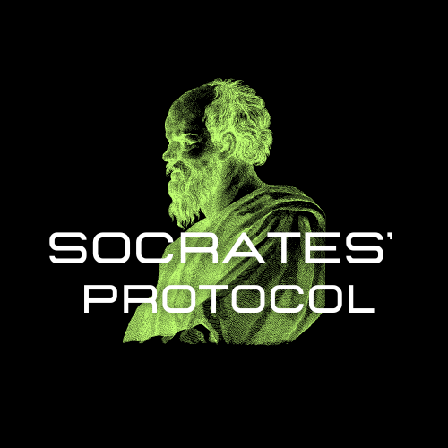
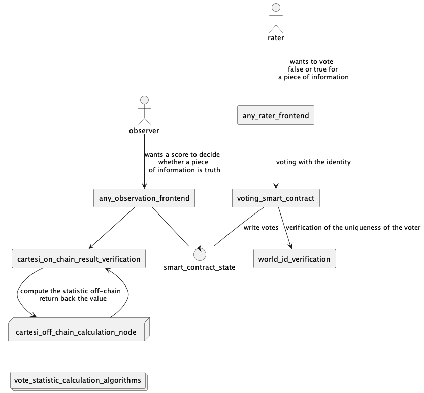

# Socrates
Socrates is a credibility
quantification protocol
that enables greater objectivity
when making decisions about the
truth or falsity of information.

## Architecture overview

The philosophy behind Socrates is its modularity. 
With Socrates you can quantify the credibility of any kind 
of information, like:

- web page url
- whitepaper id
- natural language statement

this is possible thanks to the ability to connect any type of 
frontend for observation and vote. 

## Technologies
- Cartesi (for off-chain vote statistic calculation and on-chain verification) | ✅ implemented, run and tested on localhost
- EAS (for weighted votes) | ✅ implemented in the frontend application and working fine
- Ethereum testnet (voting smart contract) | 🚧 smart contract written, but not well tested
- Worldcoin (for unique identity) | ⚠️ almost implemented, problems with angular compatibility

In this repository you can find different parts of the application (each one has its own Readme):
- `/basic_rate_observation_frontend` An example of the observation frontend application
(AES implementation and Cartesi calls can be found there)
- `/smart_contract` Solidity smart contract allowing people to vote
- `cartesi_statistic_calculation_dapp` An example of a voting algorithm plugin